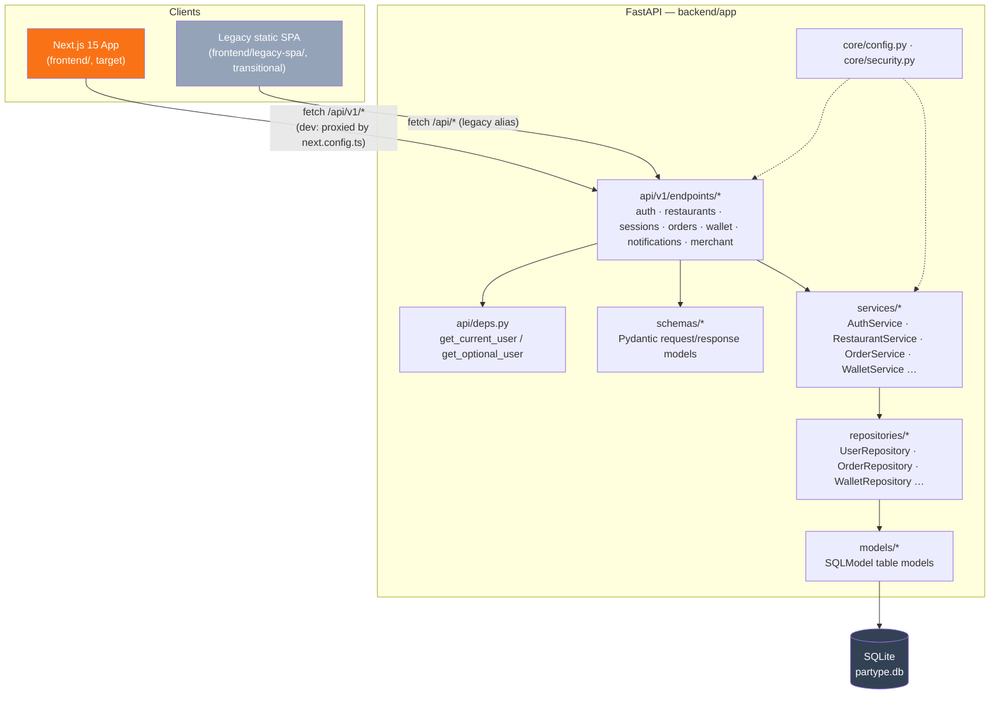

# PartyPe — Architecture

## System diagram

## Layers (backend)

| Layer | Path | Responsibility |
|---|---|---|
| API | `app/api/v1/endpoints/*.py` | HTTP concerns only: parse request, call one service method, shape the response. No DB access, no business rules. |
| Service | `app/services/*.py` | Business logic. Orchestrates one or more repositories. Raises domain exceptions (`AuthError`, `WalletError`) that the API layer translates to HTTP status codes. |
| Repository | `app/repositories/*.py` | Only place that touches `sqlmodel.Session` / `select()`. One class per aggregate, extends `BaseRepository`. |
| Model | `app/models/*.py` | SQLModel `table=True` classes — persistence shape. |
| Schema | `app/schemas/*.py` | Pydantic-only request/response classes — API contract shape. Deliberately separate from models so a response shape can change without migrating the database, and vice versa. |
| Core | `app/core/config.py`, `app/core/security.py` | Settings (env-var driven) and auth primitives. No dependency on any other layer. |

Dependency direction is one-way: **API → Service → Repository → Model**. Nothing below a layer imports from above it. `core` has no dependencies on any other layer.

## API versioning

- Canonical: `/api/v1/...`
- Legacy alias: `/api/...` — the exact same router, mounted a second time under the unversioned prefix, kept only so `frontend/legacy-spa/index.html` (which calls `/api/...`) keeps working during the migration. Defined in `backend/app/core/config.py` (`legacy_api_prefix`) and wired in `backend/app/main.py`. Remove once the legacy SPA is retired (see `MIGRATION_PLAN.md`).
- Future breaking changes get a new `app/api/v2/` package and a new `api_v2_prefix`, added alongside v1 (not replacing it) until clients migrate.

## Configuration

All environment-specific values are read from env vars via `app/core/config.py` (`pydantic-settings`), sourced from a `.env` file at the repo root (see `.env.example`). Nothing environment-specific is hardcoded elsewhere in the codebase.

## Request lifecycle example — `POST /api/v1/orders`

1. `api/v1/endpoints/orders.py::create_order` receives the request, FastAPI validates it against `schemas.OrderCreate`.
2. Route calls `OrderService(session).create_order(data)`.
3. `OrderService` builds `Order` and `OrderItem` model instances and calls `OrderRepository` to persist them.
4. `OrderRepository` is the only code that touches `session.add` / `session.commit` for orders.
5. Route serializes the returned `Order` model into `schemas.OrderRead` and returns it.
