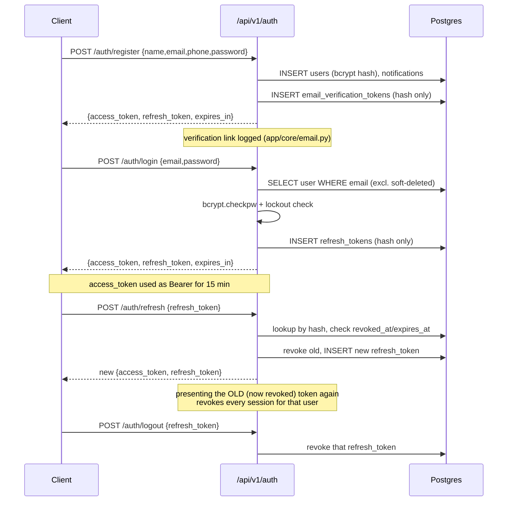

# Authentication & User Management

## Flow overview



## Access tokens vs. refresh tokens

| | Access token | Refresh token |
|---|---|---|
| Format | JWT (HS256), stateless | Opaque random string (`secrets.token_urlsafe(64)`) |
| Lifetime | 15 min (`ACCESS_TOKEN_TTL_MINUTES`) | 30 days (`REFRESH_TOKEN_TTL_DAYS`) |
| Storage | Not stored — verified by signature | SHA-256 hash in `refresh_tokens` table, never the raw value |
| Revocable? | No (too short-lived to need a blocklist) | Yes — `revoked_at` |
| Used for | `Authorization: Bearer <token>` on every request | Only `/auth/refresh` and `/auth/logout` |

**Why this split, not JWT-for-both:** a JWT can't be truly revoked without maintaining a server-side blocklist — which then means it's no longer stateless, and you've built a database-backed token system anyway, just a worse one (checking a blocklist on every request instead of one lookup at refresh time). Making the access token short-lived and stateless, and the refresh token opaque and DB-backed, gets fast unauthenticated-by-signature checks on most requests while keeping real revocation where it matters (refresh time).

## Token rotation and reuse detection

Every `/auth/refresh` call is single-use: it revokes the presented refresh token and issues a brand new pair. If a refresh token that's already been revoked is presented again, that's a signal the token leaked (someone has a copy from before it was rotated) — the server responds by revoking **every** active refresh token for that user, forcing re-login everywhere. See `AuthService.refresh` in `app/services/auth_service.py`, event `refresh_reuse_detected` in the audit log.

## Password policy

Enforced in `app/schemas/auth.py::validate_password_strength`, applied to register/reset/change-password:
- Minimum 10 characters
- At least one uppercase, one lowercase, one digit, one special (non-alphanumeric) character

No specific special-character allowlist — restricting to a narrow set (e.g. only `!@#$`) rejects legitimate passwords for no real security benefit.

## Brute-force protection vs. rate limiting

Two different, complementary mechanisms:

- **Account lockout** (`User.failed_login_attempts` / `locked_until`, DB-backed): after `MAX_FAILED_LOGIN_ATTEMPTS` (default 5) failed logins for one account, it's locked for `ACCOUNT_LOCKOUT_MINUTES` (default 15) — even with the correct password. Protects one account regardless of which IP the attempts come from. DB-backed rather than an in-memory counter so it survives restarts and is correct with more than one app instance.
- **Rate limiting** (`slowapi`, in-memory, `app/core/rate_limit.py`): per-IP request caps on `/auth/login` (5/min), `/auth/register` (5/min), `/auth/refresh` (20/min), `/auth/forgot-password` (3/min), `/auth/reset-password` (5/min), `/auth/resend-verification` (3/min). In-memory means each app instance has its own counters — correct for a single-instance free-tier deployment, not correct if scaled to multiple instances (upgrade path: point slowapi at Redis via `storage_uri`, a one-line config change, not added preemptively). Disabled in tests (`RATE_LIMIT_ENABLED=false`) so test cases aren't rate-limited by shared state.

## Email verification / password reset tokens

Both `email_verification_tokens` and `password_reset_tokens` follow the same pattern as `refresh_tokens`: a high-entropy opaque token is generated, its SHA-256 hash is stored, and the raw value only ever exists in the emailed link. `used_at` marks a token consumed (both are strictly single-use); issuing a new one invalidates any previous unused token for that user.

**Email delivery is not implemented** — no SendGrid/SES/Mailgun, per the cost requirements (free-tier compatible, no paid third-party auth/email providers). `app/core/email.py`'s `LogEmailService` logs the verification/reset link instead of sending it:
```
INFO partype.email EMAIL (verification) to=user@example.com link=http://localhost:3000/verify-email?token=...
```
This is enough to develop and test the full flow end-to-end. `EmailService` is a `Protocol` — swapping in real SMTP/provider delivery later means implementing it and pointing `email_service` at the new instance; nothing else in the codebase changes. **No frontend route exists at `/verify-email` or `/reset-password` yet** — wiring those pages is frontend work, out of scope for this (backend) milestone.

**Registration duplicate-email check** is deliberately not silent-safe like forgot-password: registering with an email that's already taken returns a clear `400 "Email already registered"`. This is standard and low-risk for registration (the person is actively trying that email themselves) — unlike forgot-password, where confirming an email exists would let an attacker enumerate registered users. `forgot-password` and `resend-verification` always return the same response whether or not the email is registered.

**Soft-deleted users still hold their email's UNIQUE constraint** (see `docs/DATABASE.md`) — registration's duplicate check uses `UserRepository.get_by_email_including_deleted`, not the deleted-excluding `get_by_email` that login uses, so re-registering under a deleted account's email correctly returns 400 instead of crashing on the database's unique index.

## User management

| Action | Endpoint | Effect |
|---|---|---|
| View profile | `GET /api/v1/users/me` | (also aliased at the pre-existing path from M2/M3) |
| Update profile | `PATCH /api/v1/users/me` | name, avatar_url |
| Change password | `POST /api/v1/users/me/change-password` | Requires current password. Revokes all other refresh tokens. |
| Deactivate | `POST /api/v1/users/me/deactivate` | `is_active=False`. Reversible in principle (no reactivation endpoint built yet — not required by this milestone). Revokes all refresh tokens, blocks login (403). |
| Delete account | `DELETE /api/v1/users/me` | Soft delete (`deleted_at`) — see next section. |

### Deactivate vs. delete

- **Deactivate** = `is_active=False`. User-initiated, reversible in principle, doesn't hide any data.
- **Delete** = soft delete (`deleted_at`, added in M3). Justified because `orders`, `restaurant_staff`, `session_participants`, etc. reference `user_id` with `RESTRICT` — a hard delete would either violate those foreign keys or require silently cascading through a customer's entire order/financial history, which "delete my account" should never do implicitly. No hard delete is offered.

## Consistent error responses

Every error — domain (`AuthError`, `UserError`, `OrderError`, `WalletError`), FastAPI's own `HTTPException`, and Pydantic validation failures — returns the same envelope via one registered handler (`app/core/errors.py`):
```json
{"error": {"code": "auth_error", "message": "Invalid credentials"}}
```
Domain exceptions subclass `AppError(status_code, code, message)`; raising one from a service is enough, no per-endpoint try/except needed.

## No sensitive data in responses

`UserRead` (`app/schemas/user.py`) never includes `password_hash`, `failed_login_attempts`, or `locked_until`. Raw refresh/verification/reset tokens are never stored — only their hashes — so there's nothing sensitive to accidentally leak back out even from an internal endpoint.

## Audit logging

Structured log lines via Python's `logging` (`app/core/audit.py`, logger `partype.audit`), not a database table — see the docstring there for why (high-frequency, not a read path the app needs, any free-tier host captures stdout automatically). Events: `register`, `login`, `logout`, `refresh`, `refresh_reuse_detected`, `verify_email`, `resend_verification`, `forgot_password`, `reset_password`, `change_password`, `deactivate`, `delete_account`.

## Environment variables (new in this milestone)

See `.env.example` for the full list with defaults: `SECRET_KEY` (required, no default), `JWT_ALGORITHM`, `ACCESS_TOKEN_TTL_MINUTES`, `REFRESH_TOKEN_TTL_DAYS`, `EMAIL_VERIFICATION_TTL_HOURS`, `PASSWORD_RESET_TTL_MINUTES`, `BCRYPT_ROUNDS`, `MAX_FAILED_LOGIN_ATTEMPTS`, `ACCOUNT_LOCKOUT_MINUTES`, `RATE_LIMIT_ENABLED`, `PUBLIC_APP_URL`.

## Testing

`backend/tests/test_auth.py`, 34 tests, run against a real migrated Postgres database (`partype_test`, recreated and migrated via Alembic each test session — not SQLite, since models use Postgres-specific UUID columns; not `create_all`, since the point is exercising the same migration path production uses). Tables truncated between tests for isolation.

```bash
cd backend
pip install -r ../requirements-dev.txt
pytest tests/ -v
```

Covers: registration (success, duplicate email, weak password, invalid email), login (success, invalid credentials, nonexistent user, legacy alias), `/users/me` (success, no token, malformed token, no sensitive fields), expired access tokens, refresh rotation + reuse detection, logout (+ legacy alias), email verification (success, invalid token, single-use), resend-verification (no enumeration), forgot/reset password (no enumeration, weak password rejected, revokes other sessions), brute-force lockout (+ counter reset on success), deactivate blocks login, change-password (wrong current password, revokes other sessions), delete-account (soft delete, blocks login, email correctly still blocks re-registration).
